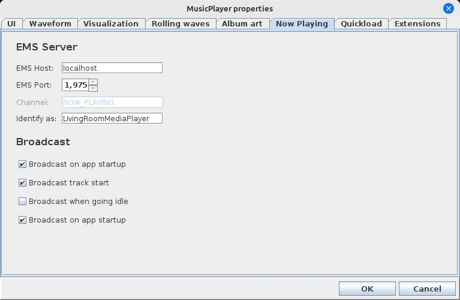

# ext-mp-now-playing

## What is this?

This is an extension for the [musicplayer](https://github.com/scorbo2/musicplayer) application which allows
broadcasting the currently playing track to an [EMS](https://github.com/scorbo2/ems) server.

### How do I use it?

Clone the repo and build the jar with maven:

```shell
git clone https://github.com/scorbo2/ext-mp-now-playing.git
cd ext-mp-now-playing
mvn package
```

You can then copy the extension jar file to wherever you keep your musicplayer extensions:

```shell
cp target/ext-mp-now-playing-2.5.0-jar-with-dependencies.jar ~/.MusicPlayer/extensions
```

Then restart musicplayer and you should find the extension settings in the properties dialog:



You just need to point it to wherever your EMS server is running. When the properties dialog is OK'd, 
the extension will connect automatically. From that point on, you should receive a broadcast message
on the `NOW_PLAYING` channel on that EMS server with the information about whatever track is playing:

```
2025-05-16 07:54:37 P.M. [INFO] [LivingRoomMediaPlayer] now playing "test.mp3" by ExampleArtist
```

You can configure the name that the extension will use with the broadcast messages. Here we're telling
it to identify as `LivingRoomMediaPlayer` to distinguish it from any other musicplayer instances you
may have on your local network.

### Requirements

MusicPlayer 2.5 or higher.
EMS 1.1 or higher.

### License

Musicplayer, EMS, and this extension are made available under the MIT license: https://opensource.org/license/mit
