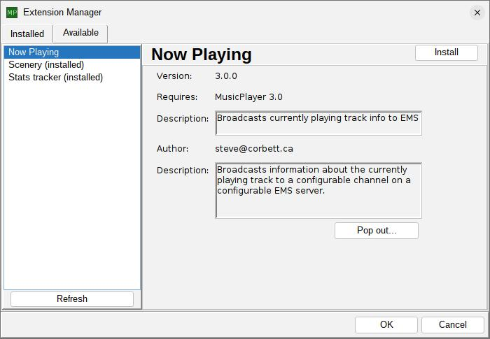
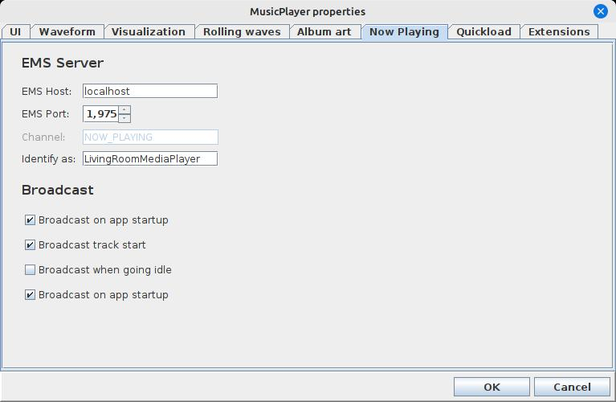

# ext-mp-now-playing

## What is this?

This is an extension for the [musicplayer](https://github.com/scorbo2/musicplayer) application which allows
broadcasting the currently playing track to an [EMS](https://github.com/scorbo2/ems) server.

## How do I get it?

### Option 1: dynamic download and install

**NEW!** Starting with MusicPlayer 3.0, you no longer have to manually build and install the extension!
Now, you can use the new and improved extension manager dialog to dynamically download the latest extension
version and install it automatically:



Go to the "available" tab and pick "Now playing" from the list on the left. Then you can hit the "install"
button in the top right. The application will prompt you to restart.

If you wish to remove the extension later, you can revisit the
extension manager dialog, pick "Now playing" on the "Installed" tab, and hit the "uninstall" button in the top right.

### Option 2: manual download and install

You can also manually download the extension jar:
[ext-mp-now-playing-4.0.0-jar-with-dependencies.jar](http://www.corbett.ca/apps/MusicPlayer/extensions/4.0/ext-mp-now-playing-4.0.0-jar-with-dependencies.jar)

Save it to your ~/.MusicPlayer/extensions directory and restart the application.

### Option 3: build from source

You can clone this repo and build the extension jar with maven (Java 17 required):

```shell
git clone https://github.com/scorbo2/ext-mp-now-playing.git
cd ext-mp-now-playing
mvn package # NOTE! You must have MusicPlayer-4.0 in your local maven repository for this to work!

# Copy the result to extensions directory:
cp target/ext-mp-now-playing-4.0.0-jar-with-dependencies.jar ~/.MusicPlayer/extensions
```

## Okay, it's installed, now how do I use it?

Once installed, you should find the extension settings in the properties dialog:



You just need to point it to wherever your EMS server is running. When the properties dialog is OK'd,
the extension will connect automatically. From that point on, you should receive a broadcast message
on the `NOW_PLAYING` channel on that EMS server with the information about whatever track is playing:

```
2025-05-16 07:54:37 P.M. [INFO] [LivingRoomMediaPlayer] now playing "test.mp3" by ExampleArtist
```

You can configure the name that the extension will use with the broadcast messages. Here we're telling
it to identify as `LivingRoomMediaPlayer` to distinguish it from any other musicplayer instances you
may have on your local network.

## Requirements

Compatible with any 4.x version of MusicPlayer.
EMS 1.1 or higher.

## License

MusicPlayer, EMS, and this extension are made available under the MIT license: https://opensource.org/license/mit
